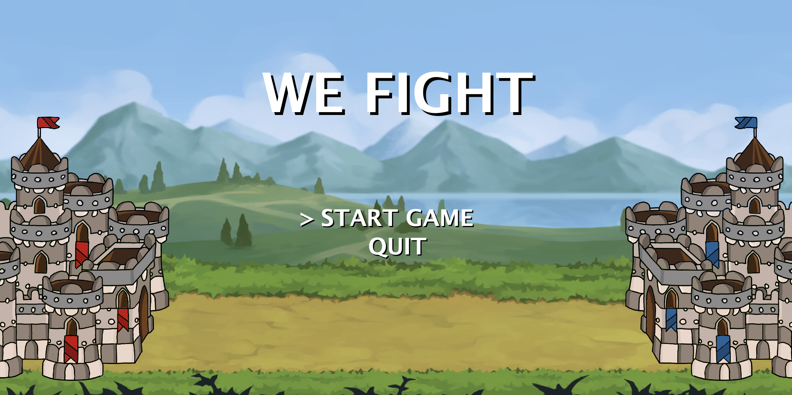
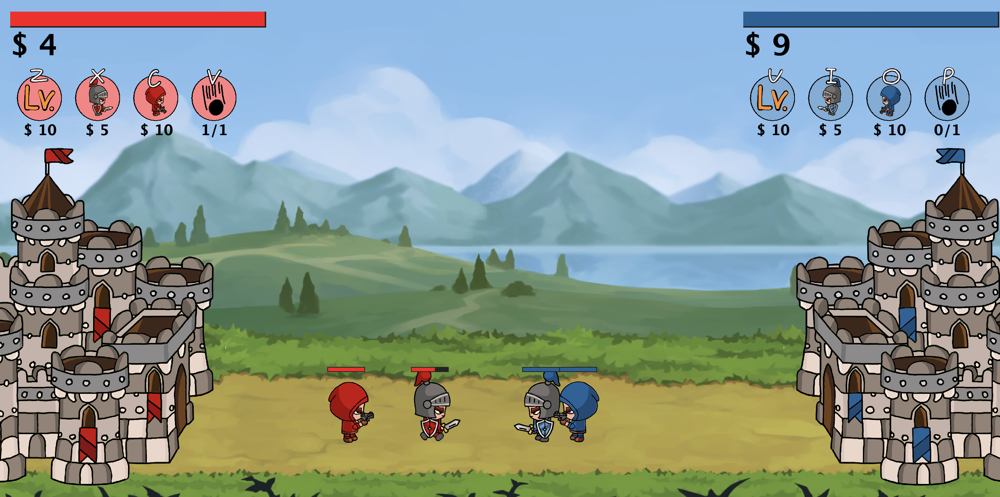
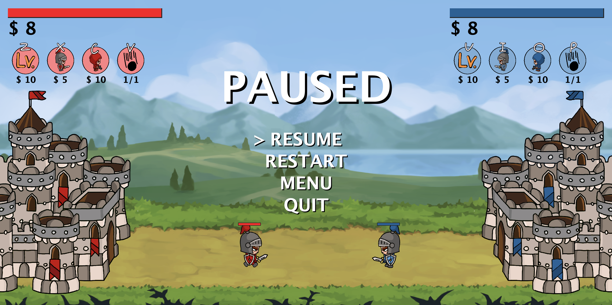

# We Fight! Game Project




## Project Overview

Welcome to We Fight! - an engaging and strategy-based battle game developed in Java. In this game, two players compete against each other, aiming to destroy the opponent's base. The gameplay involves collecting money, upgrading base, spawning soldiers of different types, and using a special attack known as the "Ultimate". The graphical user interface (GUI) for We Fight! is implemented using Java Swing.

## Getting Started

To join the exciting world of We Fight!, you first need to install the Java Development Kit (JDK) on your computer. Once you have the JDK installed, you can download the game's source code and compile it using the command line by type.

First type in the terminal
```
javac Main.java
```

Then,

```
java Main
```

Now, you are at the main menu of the game then, use up and down to select the choice and enter it to start the game.


## Game Features and How to Play

### Key to play

```
Red Side
Z : Upgrade base
X : Spawn sword soldier
C : Spawn gun soldier
V : Use ultimate

Blue Side
U : Upgrade base
I : Spawn sword soldier
O : Spawn gun soldier
P : Use ultimate
```


### 1. Upgrade Your Base Kingdom

In the game, your castle represents your base. Upgrading your base allows you to collect money faster, giving you an edge over your opponent.
### 2. Spawn Soldiers

You have the option to spawn two types of soldiers to help fight your battles. The damage of the sword and hp is different. Now it have two type `Sword` and `Gun`

The cost for spawning each type of soldier will be displayed on the screen.

### 3. Unleash the Ultimate

The "Ultimate" is a powerful weapon that can damage any opposite soldier in the middle.

### 4. Engage in Player-vs-Player (PvP) Mode

We Fight! provides a PvP mode where you compete against another player in real-time. The aim is to strategically collect money, upgrade your base, spawn soldiers, and use your Ultimate to attack the opponent's base and defend your own. The game concludes when one player's tank is destroyed.

## Design Patterns Implemented

We Fight! incorporates several design patterns to ensure efficient performance and scalability:

1. **State Pattern:** This pattern is used to represent different states of the game, such as Menu, Playing, Pausing, and Result, making the game adaptable to varying situations.

2. **Factory Pattern:** This pattern is used for the creation of Sword Soldier and Armed Soldier objects without having to specify their exact classes. A SoldierFactory class with a createSoldier() method spawns a soldier as per the player's choice.

3. **Flyweight Pattern:** This pattern is used to optimize memory usage by sharing intrinsic properties of image.
## Conclusion

We Fight! offers a fun and strategic gameplay experience that is easy to understand and play, making it suitable for players of all ages. With the game's source code available for download, players can customize the game to their liking. Join us in this thrilling tank battle and enhance your strategic skills while having fun!


## Team

```
Jirasak Tumbal 6410546114
Warat Poovorakit 6410545771
Setthanan Thongpanchang 6410546319
```
